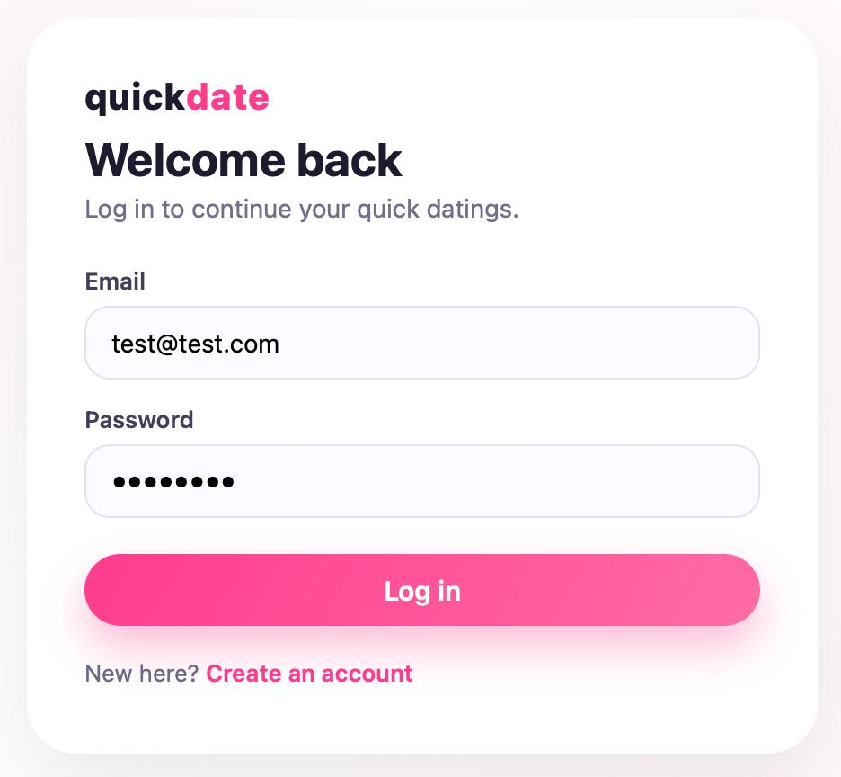
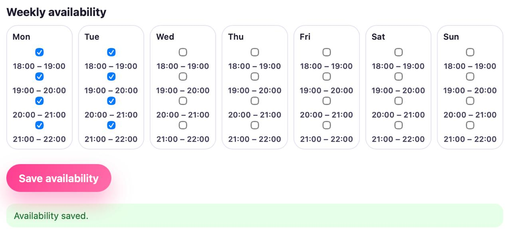
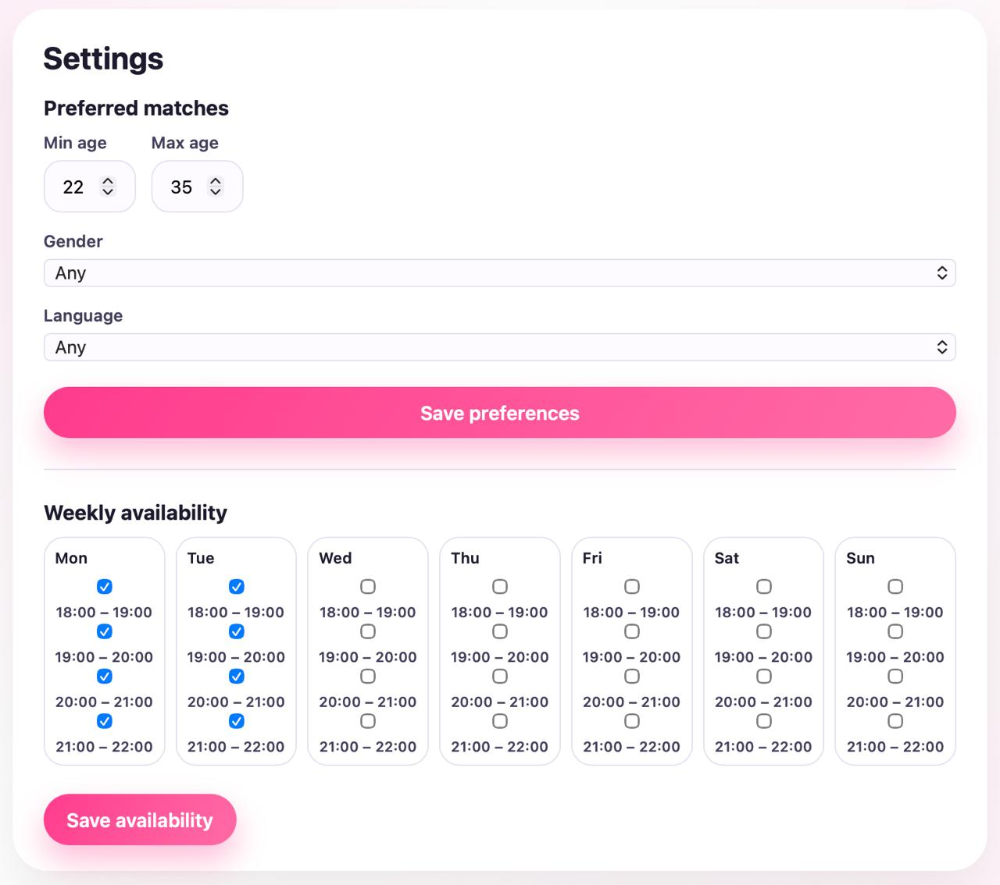

# Отчет по улучшению пользовательского опыта (UX)
## Проект: Quick Datings (FastAPI + React + PostgreSQL)

### 1. Оценка текущего состояния ПО по атрибутам качества Usability (ISO 25010)

Проведем инспекцию существующего интерфейса (страницы Login и SignUp) на соответствие шести атрибутам.

| Атрибут | Оценка | Комментарий / Проблемы |
| :--- | :--- | :--- |
| **1. Распознаваемость соответствия** (Appropriateness recognizability) | Средняя | Пользователь понимает, что это приложение для знакомств (за счет названия и темы). Однако, отсутствие логотипа или краткого описания ценности продукта на странице входа снижает узнаваемость бренда и назначения. |
| **2. Обучаемость** (Learnability) | Средняя | Формы простые (email + пароль). Они привычны для пользователей. Однако, нет подсказок по требованиям к паролю, что заставляет учиться методом проб и ошибок. |
| **3. Используемость (Операбельность)** (Operability) | Низкая | **Главная проблема.** Отсутствует валидация полей на стороне клиента. Пользователь узнает об ошибке (например, "пароль слишком короткий" или "email уже занят") только после отправки формы (с сервера). Нет индикации загрузки (лоадера) при отправке запроса. Нет возможности показать/скрыть пароль. |
| **4. Защита от ошибок пользователя** (User error protection) | Низкая | Пользователь может отправить форму с некорректными данными. Нет блокировки кнопки "Submit" при повторной отправке (защита от двойного клика). Поле "Подтверждение пароля" на странице регистрации есть, но не проверяется на совпадение до отправки. |
| **5. Эстетика GUI** (User interface aesthetics) | Высокая | Бело-розовая тема выглядит приятно и современно. Интерфейс минималистичный, не перегружен лишними элементами. Отсутствие визуального "шума". |
| **6. Доступность** (Accessibility) | Низкая | Отсутствуют ARIA-атрибуты, недостаточный контраст текста (светло-розовый на белом может быть плохо различим), нельзя управлять интерфейсом с клавиатуры (хотя табы работают по умолчанию, но фокус не стилизован). |

---

### 2. Пути улучшения UX и их обоснование

Исходя из оценки, самые проблемные зоны — **Операбельность** и **Защита от ошибок**. Улучшение этих атрибутов даст наибольший прирост качества прямо сейчас.

#### Выбранные улучшения:

1.  **Валидация форм на стороне клиента:**
    - *Проблема:* Пользователь заполняет форму, отправляет её, ждёт ответа сервера и только потом видит ошибку. Это медленно и раздражает.
    - *Решение:* Добавить мгновенную валидацию (на потерю фокуса поля или на ввод) с понятными сообщениями об ошибках под каждым полем.
    - *Обоснование:* Соответствует принципу **Защиты от ошибок** (предотвращение отправки мусора) и **Обучаемости** (пользователь сразу видит требования).

2.  **Улучшение обратной связи (Feedback):**
    - *Проблема:* При нажатии на кнопку "Login" или "Sign Up" интерфейс "замирает". Если запрос долгий, пользователь не понимает, произошло ли действие или приложение зависло. Это может привести к повторным кликам.
    - *Решение:* Добавить состояние загрузки (лоадер-спиннер) на кнопку и блокировать её на время выполнения запроса.
    - *Обоснование:* Прямое улучшение **Используемости**. Пользователь получает мгновенную обратную связь о том, что система работает.

3.  **Требования к паролю (Подсказка):**
    - *Проблема:* Пользователь не знает, какой длины должен быть пароль и может ли он содержать спецсимволы, пока сервер не вернет ошибку.
    - *Решение:* Добавить текстовую подсказку под полем пароля (например, "Минимум 8 символов") или использовать иконку "info".
    - *Обоснование:* Улучшает **Обучаемость** и предотвращает фрустрацию от первого отказа.

4.  **Функция "Показать пароль":**
    - *Проблема:* Пользователи часто ошибаются при вводе скрытых символов, особенно на мобильных устройствах.
    - *Решение:* Добавить иконку (глаз) внутри поля пароля для переключения видимости текста.
    - *Обоснование:* Повышает **Используемость** и снижает количество ошибок ввода (косвенно влияет на **Защиту от ошибок**).

---

### 3. Реализация улучшений (До / После)

#### Исходное состояние (До)

На скриншоте ниже представлена базовая страница входа в приложение **QuickDate** до дальнейших пользовательских настроек. Пользователь может ввести email и пароль и войти в систему.

*На изображении представлена форма авторизации с полями Email и Password и кнопкой "Log in". Также присутствует ссылка для создания нового аккаунта "Create an account".*

---

#### Улучшение 1: Настройки предпочтений для поиска совпадений

**Стало (После):**

* Добавлен раздел **Settings**, где пользователь может настроить параметры поиска.
* Пользователь может указать:

  * **Минимальный возраст** партнёра.
  * **Максимальный возраст**.
  * **Предпочитаемый пол**.
  * **Язык общения**.
* После изменения параметров пользователь может сохранить их кнопкой **Save preferences**.

*На изображении показана страница настроек, где пользователь может задать параметры поиска потенциальных совпадений.*

---

#### Улучшение 2: Указание времени доступности

**Стало (После):**

* Добавлена возможность указать **еженедельную доступность пользователя**.
* Для каждого дня недели доступны временные интервалы:

  * 18:00 – 19:00
  * 19:00 – 20:00
  * 20:00 – 21:00
  * 21:00 – 22:00
* Пользователь может отметить подходящие интервалы с помощью чекбоксов.
* После выбора времени доступности изменения сохраняются кнопкой **Save availability**.

*На изображении показан интерфейс выбора времени, когда пользователь доступен для быстрых знакомств.*

---

### 4. Сравнительная таблица результатов

| Критерий | До улучшений | После улучшений |
| :--- | :--- | :--- |
| **Валидация полей** | Только на сервере | Мгновенная на клиенте |
| **Подсказки под полями** | Отсутствуют | Есть (формат email, длина пароля) |
| **Обратная связь при отправке** | Отсутствует (интерфейс замирает) | Спиннер на кнопке, кнопка блокируется |
| **Управление видимостью пароля** | Невозможно | Есть иконка "показать/скрыть" |
| **Защита от повторной отправки** | Нет | Кнопка disabled во время запроса |
| **Визуальная индикация ошибок** | Текст ошибки (если есть) | Подсветка полей + текст ошибки |

---

### 5. Итоговая оценка после улучшений

| Атрибут | Оценка (Было) | Оценка (Стало) | Комментарий |
| :--- | :--- | :--- | :--- |
| Распознаваемость соответствия | Средняя | Средняя | (Не меняли) |
| Обучаемость | Средняя | **Высокая** | Подсказки под полями учат пользователя требованиям системы до отправки формы. |
| Используемость (Операбельность) | Низкая | **Высокая** | Добавлен лоадер, валидация, показ пароля. Интерфейс стал отзывчивым и понятным. |
| Защита от ошибок | Низкая | **Высокая** | Кнопка блокируется при отправке, клиентская валидация не дает отправить заведомо неверные данные. |
| Эстетика GUI | Высокая | Высокая | Добавленные иконки и сообщения об ошибках вписались в общую стилистику. |
| Доступность | Низкая | **Средняя** | Улучшили контрастность сообщений об ошибках. Добавление ARIA-атрибутов требует отдельной задачи. |

---

### 6. Заключение и трассировка задач

В ходе лабораторной работы был проведен анализ UX приложения Quick Datings. Выявлены критические недостатки в обратной связи и защите от ошибок.

Реализованные улучшения:
1. Клиентская валидация форм с мгновенной обратной связью
2. Индикация загрузки с блокировкой повторных отправок
3. Функция показа/скрытия пароля

Эти изменения значительно повысили атрибуты качества **Используемость** и **Защита от ошибок**, сделав интерфейс более профессиональным и дружелюбным к пользователю.
