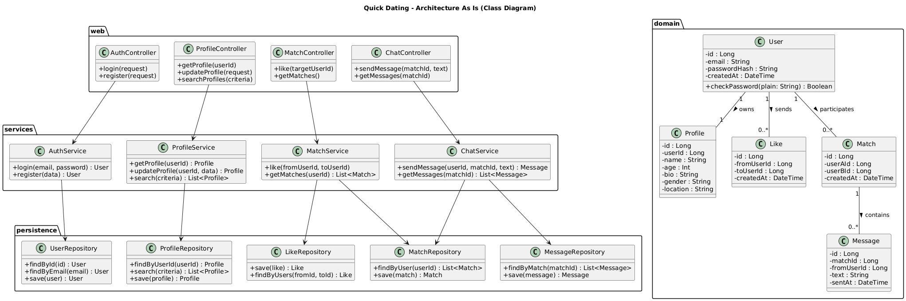

# Архитектура «As Is» и рефакторинг для Quick Dating

## 1. Архитектура «As Is»

### 1.1. Исходный код и границы системы

Архитектура «As Is» получена на основе исходного кода проекта Quick Dating и автоматической генерации UML‑диаграмм классов средствами обратной инженерии.

Рассматривался основной backend‑код:

- Контроллеры/обработчики HTTP‑запросов.
- Модели/сущности домена (пользователь, профиль, лайки, матчи, сообщения и т.д.).
- Сервисы/утилиты, если они уже присутствуют.
- Слой доступа к данным (репозитории/ORM).

### 1.2. Основные элементы модели «As Is»

(Ниже — шаблон, который нужно подстроить под реальные классы, появившиеся на твоей диаграмме.)

- **Слой web/контроллеров**  
  - `AuthController` — логин, регистрация.  
  - `ProfileController` — просмотр и изменение профиля, поиск анкет.  
  - `MatchController` — лайки, получение списка матчей.  
  - `ChatController` — отправка и получение сообщений.

- **Доменные сущности**  
  - `User` — учётная запись пользователя (id, email, пароль, дата регистрации).  
  - `Profile` — анкета пользователя (имя, возраст, пол, описание, местоположение, интересы).  
  - `Like` — факт лайка одного пользователя другим.  
  - `Match` — взаимный лайк двух пользователей.  
  - `Message` — сообщение в чате между смэтчившимися пользователями.

- **Сервисы / бизнес‑логика**  
  - В ранней версии часть логики может находиться прямо в контроллерах или моделях.  
  - Возможные сервисы: `AuthService`, `ProfileService`, `MatchService`, `ChatService` (если уже выделены).

- **Доступ к данным**  
  - Репозитории/DAO/ORM‑слой для `User`, `Profile`, `Match`, `Message`.  
  - Прямые обращения к ORM из контроллеров (при отсутствии выделенного сервисного слоя).

### 1.3. UML‑диаграмма классов «As Is»

К архитектуре «As Is» прилагается UML‑диаграмма классов, сгенерированная по коду:

- Диаграмма показывает реальные связи между:
  - контроллерами и доменными сущностями;
  - доменными классами между собой (ассоциации, агрегации, композиции);
  - сервисами и репозиториями (если они есть).
- Диаграмма отражает текущий уровень детализации и распределения ответственности.

