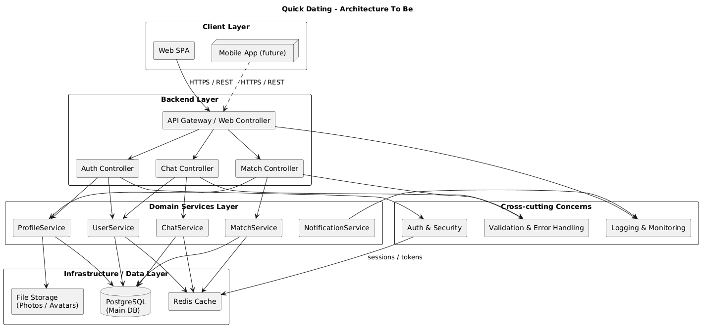

# Архитектура «To Be» для системы Quick Dating

## 1. Тип приложения

Quick Dating — многопользовательское веб‑приложение для знакомств, работающее по модели клиент‑сервер.  
Пользователь взаимодействует с системой через веб‑клиент (SPA) или мобильное приложение, выполняя регистраию, настройку профиля, поиск анкет, лайки/дизлайки, получение матчей и переписку в чате.

Основные характеристики типа приложения:

- Веб‑приложение с интерактивным интерфейсом.
- REST API как основной интерфейс взаимодействия клиента и сервера.
- Потенциальная поддержка реального времени (чат, онлайн‑статусы) через WebSocket.
- Возможность подключения разных клиентов (web, mobile) к единому backend.

---

## 2. Стратегия развёртывания

Целевая стратегия развёртывания — модульная (с возможностью перехода к микросервисной) архитектура в контейнеризованной среде.

Предполагается:

- Backend (API) — отдельный сервис в Docker‑контейнере.
- Frontend (SPA) — отдельный контейнер.
- База данных (PostgreSQL) — отдельный контейнер/сервис.
- Redis (кеш/сессии/реальное время) — отдельный контейнер.
- Cервис уведомлений и сервис WebSocket для чата.

---

## 3. Обоснование выбора технологий

Технологический стек (пример, адаптируемый под реальную реализацию):

- **Backend**: Python + FastAPI.  
  Причины: быстрый старт, зрелая экосистема, удобное описание REST‑эндпоинтов, встроенные механизмы сериализации и валидации.
- **База данных**: PostgreSQL.  
  Причины: мощный SQL‑движок, транзакционность, индексы и расширения, подходящая модель для анкет, лайков, матчей и сообщений.
- **Кеш / сессии / real‑time**: Redis.  
  Причины: быстрая работа в памяти, удобен для хранения сессий, временных данных, очередей и pub/sub.
- **Фронтенд**: SPA на React.  
  Причины: удобный построитель сложных интерфейсов, высокий уровень интерактивности, стандарт де‑факто для web‑клиентов.
- **Хранилище файлов**: локальное хранилище для фотографий пользователей.

Этот стек позволяет относительно легко реализовать функциональность приложения знакомств, масштабировать нагрузки и поддерживать дальнейшее развитие.

---

## 4. Показатели качества

Ключевые нефункциональные требования (качество архитектуры):

- **Производительность**  
  - Приемлемое время ответа для основных операций (просмотр анкет, лайки, отправка сообщений).  
  - Использование индексов в БД, минимизация количества запросов, кеширование часто запрашиваемых данных.

- **Масштабируемость**  
  - Возможность горизонтального масштабирования frontend и backend.  
  - Использование Redis/кеша для разгрузки БД.  
  - Разнесение «горячих» зон (чат, матчинговый сервис) на отдельные сервисы при росте.

- **Надёжность и отказоустойчивость**  
  - Корректная обработка ошибок, отсутствие «падений» при нештатных запросах.  
  - Резервное копирование БД.  
  - Health‑check’и контейнеров, рестарт при сбоях.

- **Безопасность**  
  - Шифрование паролей, работа только по HTTPS.  
  - Защита от типичных web‑уязвимостей (SQL‑инъекции, XSS, CSRF).  
  - Грамотная работа с персональными данными (настройки приватности профиля).

- **Поддерживаемость**  
  - Слоистая архитектура, минимальные связи между слоями.  
  - Чёткое разделение ответственности модулей.  
  - Наличие тестов, документации API и базового логирования.

---

## 5. Сквозная функциональность

Сквозная функциональность, проходящая через разные слои системы:

- **Аутентификация и авторизация**  
  - Работа с токенами/сессиями.  
  - Ограничение доступа к закрытым ресурсам (профиль, сообщения).

- **Безопасность**  
  - Проверка прав доступа.  
  - Валидация входных данных.

- **Логирование и аудит**  
  - Запись ключевых операций (логин, регистрация, лайки, матчи, отправка сообщений).  
  - Логи ошибок и технические логи.

- **Валидация и обработка ошибок**  
  - Единый подход к валидации данных (на уровне DTO/сериализаторов).  
  - Унифицированный формат ответа при ошибках.

- **Мониторинг и метрики**  
  - Базовые метрики работы: число активных пользователей, количество запросов, задержки.  
  - Возможность интеграции с системами мониторинга.

Реализация сквозных функций:

- Через middleware/фильтры в backend‑фреймворке.  
- Через отдельные сервисы/утилиты (security, logging, metrics).  
- Через единый модуль конфигурации.

---

## 6. Структурная схема и слои

Слои архитектуры «To Be»:

1. **Client Layer**  
   - Web SPA.  
   - (Опционально) Mobile App.

2. **Backend Layer (Transport / API)**  
   - API Gateway / контроллеры (auth, profile, match, chat).  
   - Обработка HTTP‑запросов, маппинг на доменные операции.

3. **Domain Services Layer**  
   - UserService, ProfileService, MatchService, ChatService, NotificationService.  
   - Бизнес‑логика, правила матчей, фильтрация анкет, обработка сообщений.

4. **Infrastructure / Data Layer**  
   - PostgreSQL (основные доменные сущности).  
   - Redis (кеш, сессии, real‑time).  
   - Хранилище файлов (фото и медиа).

5. **Cross‑cutting Concerns**  
   - Auth & Security.  
   - Logging & Monitoring.  
   - Validation & Error Handling.

